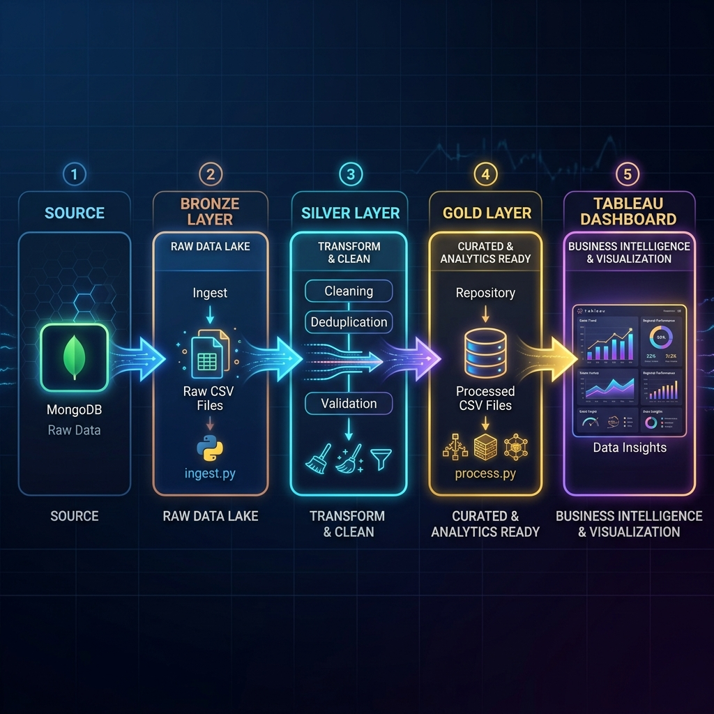

# Medallion Data Pipeline (MongoDB -> Tableau)

This directory contains the Python data engineering pipeline that extracts raw data from your MongoDB database, transforms and structures it using the Medallion Architecture (Bronze -> Silver -> Gold), and prepares clean CSVs ready for visualization in Tableau on macOS.

## Pipeline Architecture Diagram



---

## Medallion Architecture Layers

### 🟫 1. Bronze Layer (Raw Ingest)
* **Description**: Raw, unmodified data directly extracted from the operational database (MongoDB).
* **Script**: [ingest.py](ingest.py) (connects to MongoDB using `pymongo`, extracts collections, and cleans up basic ObjectID types).
* **Storage Location**: [data/raw/](data/raw/)
* **Files Generated**:
  * `raw_users.csv`
  * `raw_products.csv`
  * `raw_orders.csv`
  * `raw_stocklogs.csv`
  * `raw_restocks.csv`

### ⬜ 2. Silver Layer (Cleaned & Conformed)
* **Description**: Data that has been cleaned, filtered, conformed, and aligned to consistent datatypes.
* **Process**: Handled dynamically on-the-fly inside [process.py](process.py) (casting ObjectIDs to standard strings, handling missing values, and formatting timestamps).

### 🟨 3. Gold Layer (Analytics & Aggregated)
* **Description**: Business-level aggregates, metrics, and KPI tables optimized directly for reporting and dashboard queries.
* **Script**: [process.py](process.py) (computes aggregates using `pandas`).
* **Storage Location**: [data/processed/](data/processed/)
* **Files Generated**:
  * `most_ordered_items.csv` (Product rank, total orders, units sold, cumulative revenue).
  * `customer_order_metrics.csv` (Averages, minimums, maximums, and total amounts spent per customer).
  * `customer_retention.csv` (Repeat vs Single-Order customer split counts and retention percentages).

---

## How to Run the Pipeline

You can run the entire medallion data pipeline sequentially with a single command:

```bash
# Run the pipeline from your project root
python data-pipeline/run_pipeline.py
```

This will run the raw ingestion (Bronze) and then process the conformed aggregates (Gold) in under a second.

## Tableau Integration

Point your Tableau Public or Tableau Desktop to the generated CSV files inside [data-pipeline/data/processed/](data/processed/) to create your dashboard visuals!
